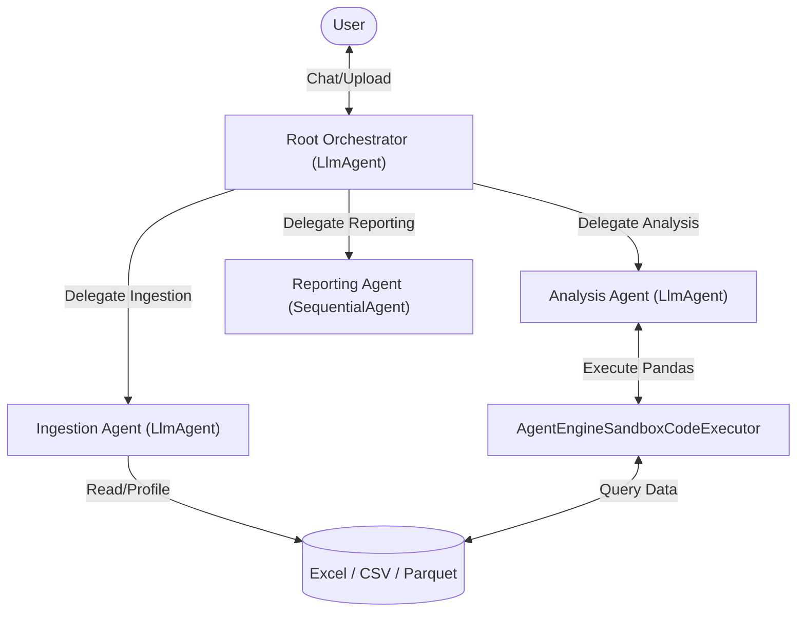

# eDiscovery Multi-Agent Analysis System

### Architecture

Using the latest Google ADK (Agent Development Kit) Python framework, the system uses an Orchestrator-Specialist pattern to handle large eDiscovery datasets efficiently.

- **Root Agent (`ediscovery_orchestrator`)**: An `LlmAgent` acting as the main interactive interface. It maintains context, evaluates user queries, and delegates tasks to the `sub_agents`.
- **Ingestion Agent (`data_ingestion_agent`)**: Responsible for securely locating uploaded Parquet, CSV, or Excel files, parsing headers, and saving the dataset schema into the ADK Session state.
- **Analysis Agent (`data_analysis_agent`)**: An `LlmAgent` equipped with `AgentEngineSandboxCodeExecutor` (or `BuiltInCodeExecutionTool`). Because eDiscovery files can be massive, this agent generates and executes Python/Pandas code dynamically in a secure sandbox to calculate exact metrics, totals, and anomalies rather than passing raw rows into the LLM context window.
- **Reporting Agent (`reporting_agent`)**: Formats the raw analytical output into structured legal deliverables.

### System Diagram

### Data Flow

1. **Upload & Profile**: User uploads an eDiscovery file. The Ingestion Agent uses a custom `FunctionTool` to extract columns and data types, storing this schema metadata in the `InMemorySessionService` (or `VertexAiSessionService`).
2. **Interact**: User asks the Root Agent a question (e.g., *"Find all duplicate time entries for Reviewer A"*).
3. **Analyze**: The Root Agent routes the request to the Analysis Agent, which writes a Pandas script, runs it via the secure Sandbox Executor against the file, and returns exact numeric results.
4. **Synthesize**: The Root Agent receives the analysis and formulates a natural language response back to the user via the `Runner`.

### Key ADK Components to Utilize

- `google.adk.agents.LlmAgent` (Configured with `sub_agents=[]` for the Root Orchestrator)
- `google.adk.tools.FunctionTool` (For deterministic file profiling)
- `google.adk.tools.AgentEngineSandboxCodeExecutor` (For secure code execution)
- `google.adk.runners.InMemoryRunner` (For interactive reason-act loops)
- `google.adk.services.InMemorySessionService` (For conversation state and memory)

